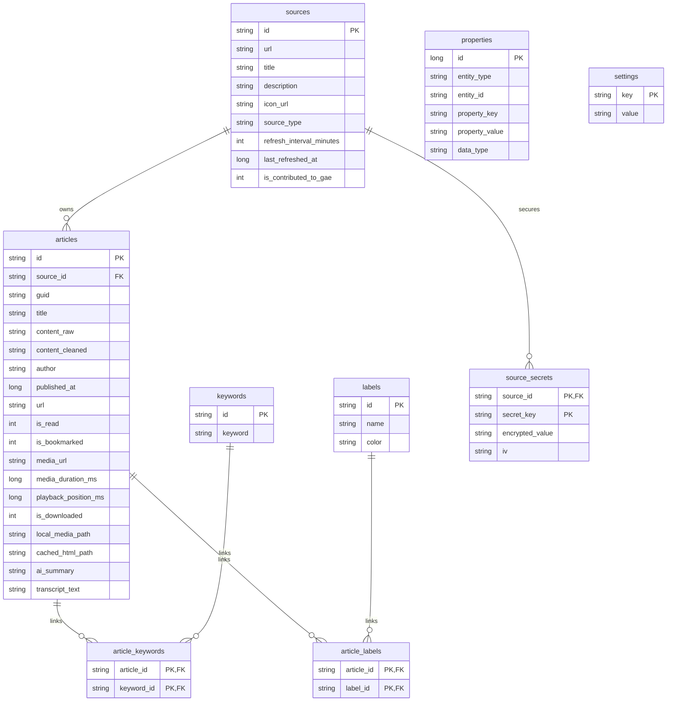
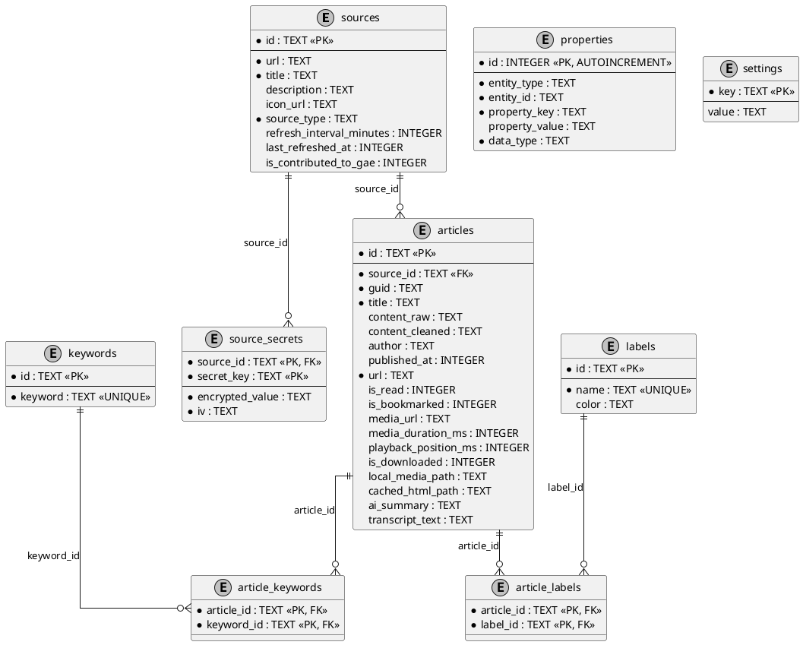

# AeonFlux Data Model

This document outlines the SQLite (via Room) database schema for the AeonFlux Android Client. The data model is designed to be offline-first, flexible for future extensions, and secure for storing secrets.

## Database Schema Diagram

Below is the Entity-Relationship diagram showing the tables, primary keys, foreign keys, and relationships.



### PlantUML Schema Diagram



## Table Definitions

### 1. `sources`
Stores information about RSS feeds, podcasts, Bluesky accounts, or other future source types.
* **`id`** (TEXT, PK): Unique identifier.
* **`url`** (TEXT): Ingestion endpoint/feed URL.
* **`title`** (TEXT): Source title.
* **`description`** (TEXT): Brief summary.
* **`icon_url`** (TEXT): Optional avatar/icon URL.
* **`source_type`** (TEXT): Enum representing source type (e.g. `'RSS'`, `'PODCAST'`, `'BLUESKY'`).
* **`refresh_interval_minutes`** (INTEGER): Ingestion refresh interval.
* **`last_refreshed_at`** (INTEGER): Epoch timestamp of the last fetch.
* **`is_contributed_to_gae`** (INTEGER): Boolean flag (0 or 1) indicating if source metadata is synchronized with backend.

### 2. `articles`
Stores items or articles ingested from sources.
* **`id`** (TEXT, PK): Unique identifier.
* **`source_id`** (TEXT, FK): Link to `sources(id)` with `ON DELETE CASCADE`.
* **`guid`** (TEXT): Original GUID from the feed.
* **`title`** (TEXT): Headline.
* **`content_raw`** (TEXT): Raw article contents.
* **`content_cleaned`** (TEXT): Cleaned/sanitized readability copy.
* **`author`** (TEXT): Author name.
* **`published_at`** (INTEGER): Publish timestamp.
* **`url`** (TEXT): Target link/website.
* **`is_read`** (INTEGER): Read status.
* **`is_bookmarked`** (INTEGER): Favorite status.
* **`media_url`** (TEXT): Direct audio stream URL (for Podcasts).
* **`media_duration_ms`** (INTEGER): Duration of audio.
* **`playback_position_ms`** (INTEGER): Exoplayer resume position.
* **`is_downloaded`** (INTEGER): Local cache status.
* **`local_media_path`** (TEXT): Path to downloaded audio files.
* **`cached_html_path`** (TEXT): Path to cached offline HTML file.
* **`ai_summary`** (TEXT): AI-generated digest.
* **`transcript_text`** (TEXT): Transcribed podcast audio text.

### 3. `keywords`
Keywords extracted from articles for tags, indexing, or search filters.
* **`id`** (TEXT, PK): Unique hash or UUID.
* **`keyword`** (TEXT, UNIQUE): Literal keyword text.

### 4. `labels`
Flexible tagging system managed manually via UI or automatically via AI rules.
* **`id`** (TEXT, PK): Unique ID.
* **`name`** (TEXT, UNIQUE): Name of the label (e.g., "AI Summary", "Important").
* **`color`** (TEXT): Hex color code.

### 5. `properties` (Entity-Attribute-Value Model)
Allows extending the fields of any primary object (`sources`, `articles`, `keywords`, `labels`) dynamically.
* **`id`** (INTEGER, PK, AUTOINCREMENT): Primary key.
* **`entity_type`** (TEXT): Type of target object (`'SOURCE'`, `'ARTICLE'`, `'KEYWORD'`, `'LABEL'`).
* **`entity_id`** (TEXT): The ID of the target object.
* **`property_key`** (TEXT): Name of the dynamic property.
* **`property_value`** (TEXT): Serialized string value.
* **`data_type`** (TEXT): Conversion type (`'STRING'`, `'INTEGER'`, `'BOOLEAN'`, `'DOUBLE'`).
* *Indices*: A unique constraint exists on `(entity_type, entity_id, property_key)` to prevent duplicate property definitions.

### 6. `source_secrets`
Stores sensitive, ciphered secrets (tokens, credentials, API keys) related to sources.
* **`source_id`** (TEXT, PK, FK): Link to `sources(id)` with `ON DELETE CASCADE`.
* **`secret_key`** (TEXT, PK): Secret label/identifier.
* **`encrypted_value`** (TEXT): Base64-encoded encrypted cipher.
* **`iv`** (TEXT): Base64-encoded initialization vector.

### 7. `settings`
App-wide key-value preferences.
* **`key`** (TEXT, PK): Configuration key.
* **`value`** (TEXT): Configuration value.

---

## Data Model Extensions and Extensibility
The `properties` table implements the Entity-Attribute-Value (EAV) design pattern. This allows adding custom fields to any source, article, keyword, or label without schema migrations. The `DatabaseService` wraps EAV queries into simple, typed getter/setter methods.

## Security & Secrets Management
Source credentials are encrypted locally using **AES/GCM/NoPadding** via the Android Keystore-backed key `AeonFluxMasterKey`. The initialization vector (IV) generated for each encryption is stored alongside the encrypted value in the `source_secrets` table.

Below is the byte/bit layout of an encrypted secret payload rendered via `mkdocs-kit` `bytefield` engine:

```bytefield
[
  {"name": "Initialization Vector (IV - 12 Bytes)", "bits": 12},
  {"name": "AES-256-GCM Encrypted Secret Payload", "bits": 32},
  {"name": "GCM Authentication Tag (16 Bytes)", "bits": 16}
]
```

